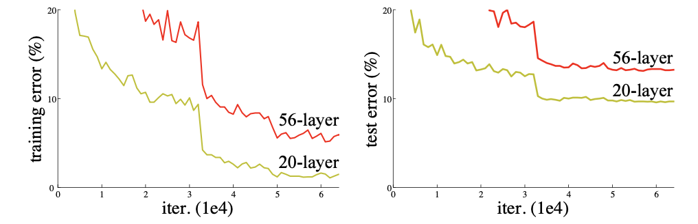
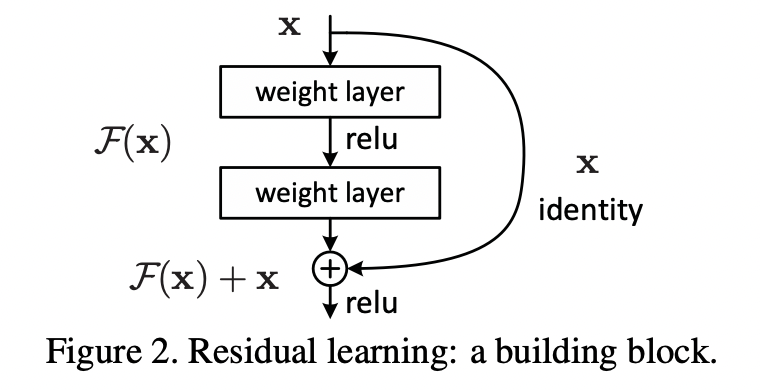

# ResNet paper Review

## Abstract

ResNet은 신경망이 깊어질수록 학습하기 어려웠던 이전의 모델들에 대해서 해결책을 제시한 모델이다.  
ResNet은 152층의 깊이까지 구현할 수 있으며, 이는 VGG보다 8배 깊으면서도 더 낮은 복잡도를 가지고 있다.

## Introduction

신경망의 깊이를 깊게하는 것은 classification에서의 성능뿐만 아니라 관련 여러 분야에서의 성능을 높힐수 있었다.  
하지만 신경망의 깊이를 지나치게 깊게할경우 훈련과정에서 정확도가 포화하거나 급격하게 저하되는 현상이 있었고 이는 train dataset에 대한 overfitting으로 인한 문제가 아니며 training에 큰 error를 발생시켰다.

이 논문은 이러한 문제에 대한 해결책을 제시하였으며 그것을 이용한 모델(ResNet)을 제시한다.  
  
  

  
  

이 논문에서 제시하는 방법인 Residual Learning은 
위 이미지와 같이 블럭을 지날때 Output에 input값을 더해주는 방법이다.   
input X를 더해주는 것을 Skip Connection(Identity Mapping)이라고 하며 이때 차원이 다르지 않는 이상 추가적인 계산은 하지 않는다. 

Idea는 skip connection이 없는 연산을 H(x)라 할때,   
H(x) = x 로 하여 모델을 학습시키는 것 보다 H(x) = F(x) + x로 하여 F(x)를 0이 되는 방향으로 학습을 시키는 것이 더 쉽다고 하며, 신경망을 지나치게 깊게 생성했을 때 발생하는 기울기 소실의 문제또한 F(x)에 대한 미분값이 0이 되더라도 x의 미분값이 1이기 때문에 도움이 된다고 한다.  

