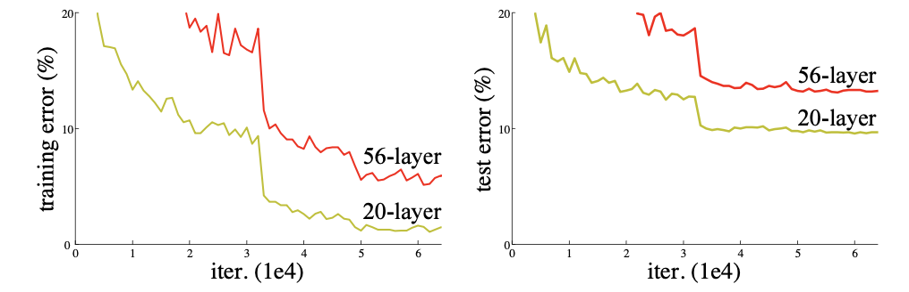
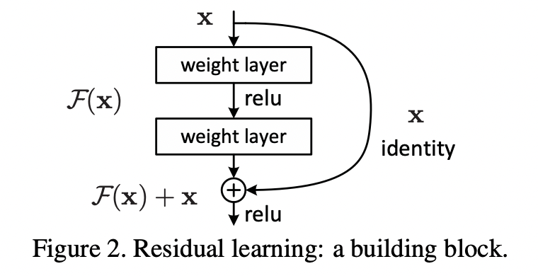
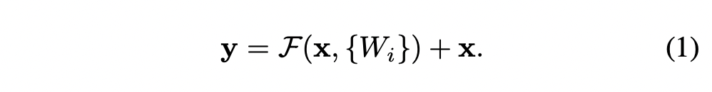
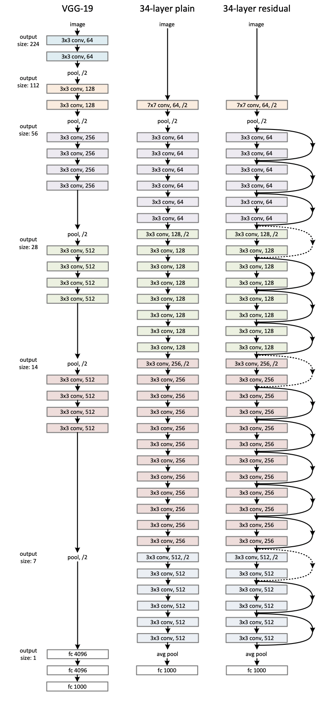
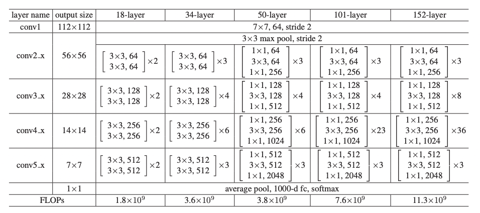

# ResNet paper Review

## Abstract

ResNet은 신경망이 깊어질수록 학습하기 어려웠던 이전의 모델들에 대해서 해결책을 제시한 모델이다.  
ResNet은 152층의 깊이까지 구현할 수 있으며, 이는 VGG보다 8배 깊으면서도 더 낮은 복잡도를 가지고 있다.

## Introduction

신경망의 깊이를 깊게하는 것은 classification에서의 성능뿐만 아니라 관련 여러 분야에서의 성능을 높힐수 있었다.  
하지만 신경망의 깊이를 지나치게 깊게할경우 훈련과정에서 정확도가 포화하거나 급격하게 저하되는 현상이 있었고 이는 train dataset에 대한 overfitting으로 인한 문제가 아니며 training에 큰 error를 발생시켰다.

이 논문은 이러한 문제에 대한 해결책을 제시하였으며 그것을 이용한 모델(ResNet)을 제시한다.

이 논문에서 제시하는 방법인 Residual Learning은
위 이미지와 같이 블럭을 지날때 Output에 input값을 더해주는 방법이다.  
input X를 더해주는 것을 Skip Connection(Identity Mapping)이라고 하며 이때 차원이 다르지 않는 이상 추가적인 계산은 하지 않는다.

Idea는 skip connection이 없는 연산을 H(x)라 할때,  
H(x) = x 로 하여 모델을 학습시키는 것 보다 H(x) = F(x) + x로 하여 F(x)를 0이 되는 방향으로 학습을 시키는 것이 더 쉽다고 하며, 신경망을 지나치게 깊게 생성했을 때 발생하는 기울기 소실의 문제또한 F(x)에 대한 미분값이 0이 되더라도 x의 미분값이 1이기 때문에 도움이 된다고 한다.

의미적으로 F(x)가 기존의 모델(비교적 깊지않은 모델)에서 추가된 것으로 받아들일 수 있으며 F(x)를 잔류학습으로 하여 구조화 한 것이다. 결론적으로 기존모델에 대해서 더 학습할 내용을 F(x)에서 하고 더 학습하지 않더라도 기존 모델만큼의 성능은 내는 의미이다.

## Deep Residual Learning

  
이 논문에서 적극도입한 skip connection방식은 위 식과 같이 계산된다.
F(x)는 Conv연산과 같은 의미하며 이 결과에 비선형함수(ReLU)가 계산된다.

각 블럭의 두 번째 비선형함수는 x(identity mapping)가 더해진 이후에 계산된다.

이미 identity mapping을 통한 skip connection의 성능을 검증했으므로 skip connection에 추가적인 연산은 하지 않는다.(차원이 안맞으면 단순 conv연산(+ReLU)진행함)
이로써 plain모델과의 성능면, 컴퓨팅 파워면에서 월등한 우위를 가져올 수 있다.
단, 논문에서 각 블럭을 계산할 때, 비선형성질이 더해지지 않으면 이 구조에 대한 효과는 없다고 말한다.

## Network Architecture

ResNet의 구조는 위 이미지와 같으며 구체적인 구조는 아래와 같다.

1. Plain Network

- 각각의 conv연산의 결과는 동일해야한다.
- 만약 feature map의 크기가 반감된다면 channel을 두 배로 늘려 시간복잡도를 유지한다.

Plain model은 위 두 개의 규칙에 의해 만들어 졌다.

2. Residual Network

Residual network는 plain 모델에 skip connection을 추가하면 된다.
이때 주의할 사항은 identity mapping도중 차원이 달라질 때인데  
이때는 2 가지 옵션이 있다.

1. 늘어난 차원방향으로 0을 채워 더한다.
2. 1x1 conv연산(stride - 2) 를 사용하여 채널을 2배 늘리고 Feature map의 크기를 반감시킨다.

각각의 conv연산 이후에 그리고 activation Function이전에 Batch Nomalization연산을 수행한다.

## Experiments

위와 같은 구조로 layer의 갯수별로 총 5개의 모델이 만들어 졌으며 아래 이미지와 같다.

